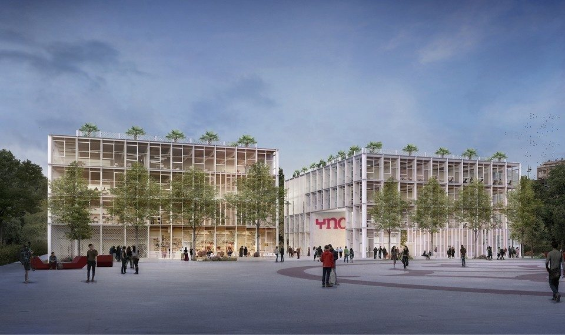

# À propos

Bienvenue sur mon blog ! Je m'appelle Kilian ROSAK et je suis actuellement en stage chez **Bashroom** pour mon année Bachelor 2 à **Toulouse Ynov Campus**. Je suis passionné par l'**Infrastructure** et **Systèmes d'Information** ainsi que le **Développement**, et j'ai créé ce blog pour partager mes expériences et connaissances dans ces domaines.

  

  
Toulouse Ynov Campus

J'ai commencé mon stage chez Bashroom le 7 février 2023, où j'ai effectué une mission en utilisant en majorité **Rust**. Au fil du stage, j'ai développé des compétences dans la résolution de problèmes complexes et la mise en place de solutions efficaces pour répondre aux besoins de l'entreprise.

Dans ce blog, je partagerai mes réalisations, mes projets et mes réflexions sur l'évolution des projets sur lesquels j'ai été assigné. Vous trouverez également mon **LinkedIn** [ici](https://www.linkedin.com/in/kilian-rosak-b84740264/) où mon **Curriculum Vitae** y est aussi publié.

Vous avez la possibilité de sauvegarder mon blog tout entier en PDF en cliquant sur le bouton **PDF** en haut à droite de la page. Vous pouvez également naviguer dans les différentes sections du blog en utilisant le menu de navigation en haut à gauche.

Je suis disponible pour toute question ou commentaire, n'hésitez pas à me contacter dans la rubrique **contact** ou en utilisant le lien vers mon profil LinkedIn. Merci de votre visite et j'espère que vous apprécierez mon travail!