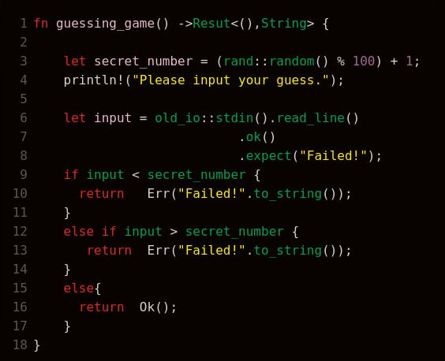

# Les compétences acquises :

Au cours de mon stage chez Bashroom, j'ai pu développer et renforcer un large éventail de compétences qui se sont révélées **essentielles** pour mon parcours professionel

J'ai eu l'opportunité de développer et de renforcer mes compétences en **Rust**. J'ai travaillé sur des projets qui m'ont permis d'explorer les fonctionnalités et les bonnes pratiques de ce langage de programmation moderne et performant. J'ai pu mettre en pratique les concepts clés de Rust tels que la **gestion d'erreur**, l'**implémentation** de modules et l'utilisation des **traits**. Cette expérience m'a permis de devenir plus à l'aise avec Rust et de l'utiliser efficacement pour créer des solutions logicielles robustes et fiables.

  

  
Exemple simple d'error handling en Rust

De plus, j'ai également développé des compétences en automatisation grâce à l'utilisation d'outils tels que le **Bash**. Cette compétence m'a permis de gagner du temps, d'éliminer les erreurs manuelles et de favoriser une approche plus efficace et fiable dans la gestion des systèmes.

  

  
Logo Bash

Enfin, j'ai également renforcé mes compétences en matière de collaboration et de communication au sein de Bashroom. J'ai appris à **communiquer** et expliquer là où je bloquais, à **partager** des connaissances, à résoudre des problèmes de manière collective et à contribuer positivement aux projets.

En somme, mon stage chez Bashroom m'a offert une opportunité précieuse de développer et d'enrichir mes compétences techniques. C'est une expérience pratique précieuse pour ma future carrière professionnelle.